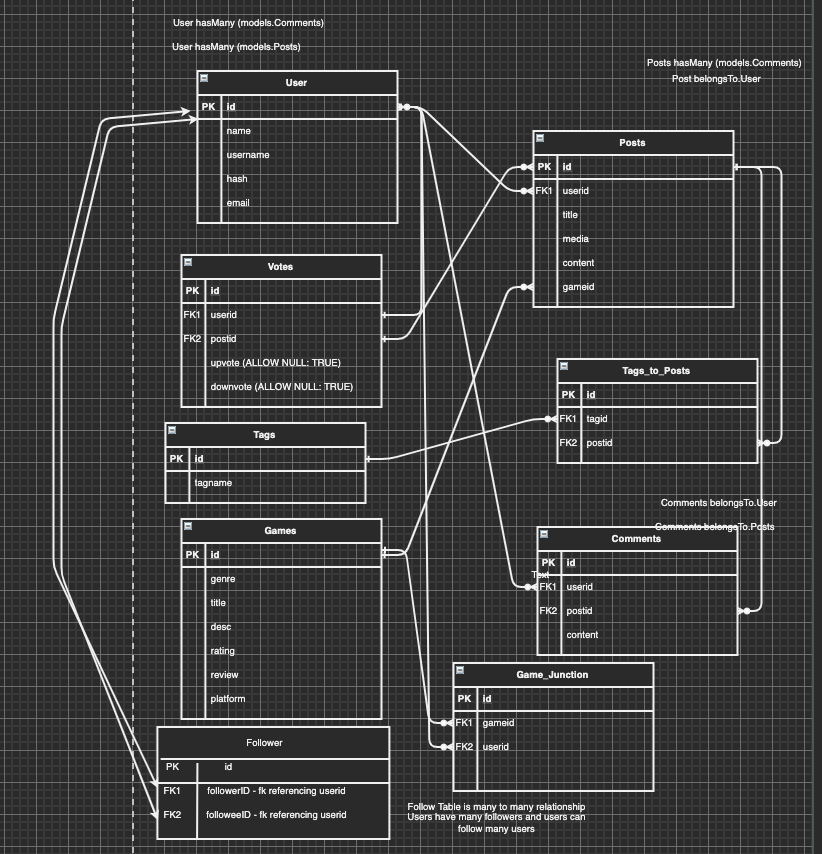
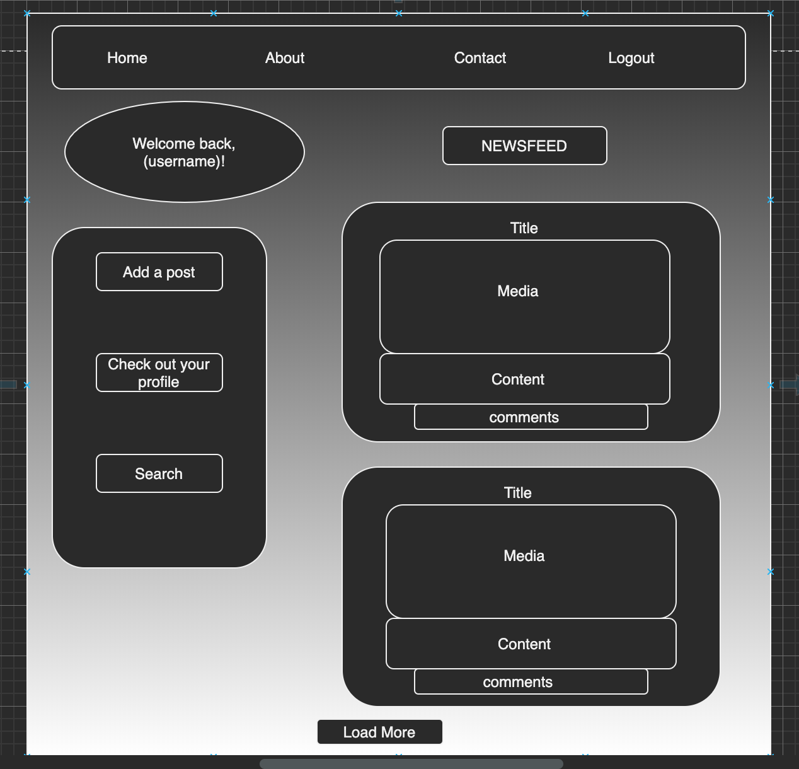

<h1 align="center"> Gamer's Paradise </h1>

<tb></tb>

<h2 align="center"> Objective/Goals </h2>
- This fullstack modern web application is a social media site for gamers, by gamers, designed to bring gamers together. This application allows users to sign up and make a profile. You can then add posts, make comments, follow other users and like their posts. Each user has a corresponding profile picture and a list of their favorite games. The application also keeps track of the most popular games site-wide and has profile pages for users and for games. 

<h2 align="center"> User Story </h2>

- As a User I want to see a Homepage with app info
- As a User I want to be able to sign up or login at the homepage
- As a User I want to login and see my posts and others post
- As a User I want to be able to add posts with pictures/videos using username 
- As a User I want to add comments to other's posts
- As a User I want to be able to Logout
- As a User I want to search for games 
- As a User I want to search for posts
- As a User I want to edit and delete my posts
- As a User I want to edit and delete my comments

<h2 align="center"> Tech/Tools Used </h2>

- HTML
- CSS - Flexbox
- Npm
- Express.js
- AWS
- JavaScript
- Node.js
- Postgres/SQL
- Sequelize.js
- React

<h2 align="center"> Problems Faced </h2> 
- Converting our backend templates into React components
- Converting our routes from backend to React Routes
- Fixing the authorization verification for protected routes
- Uploading videos and images with multer middleware
- Fixing issues with modals and the controller functions used for them
- Keeping track of the global top games based on user interaction with sequelize
- Updating our post and comment information in our server and requesting the information on our frontend
- Fixing our search issues based on our sequelize models and sequelize functions
- Adding links to our display names in our posts and comments

<h2 align="center"> Database Design </h2>

 
<h2 align="center"> Diagrams  </h2>

 
<h2 align="center"> Demo of App </h2>

<h2 align="center"> Contributors </h2>

### Joshua Lopez

- [Github](https://github.com/JoshuaNow)
- [Linkedin](https://www.linkedin.com/in/joshua-lopez-dev/)

### Ian Storms

- [Github](https://github.com/Stormy110)
- [Linkedin](https://www.linkedin.com/in/ianstorms/)

### Kevin Tucker

- [Github](https://github.com/k5tuck)
- [Linkedin](https://www.linkedin.com/in/ktuck18/)

### Shoel Uddin

- [Github](https://github.com/shoel-uddin)
- [Linkedin](https://www.linkedin.com/in/shoel-uddin/)
