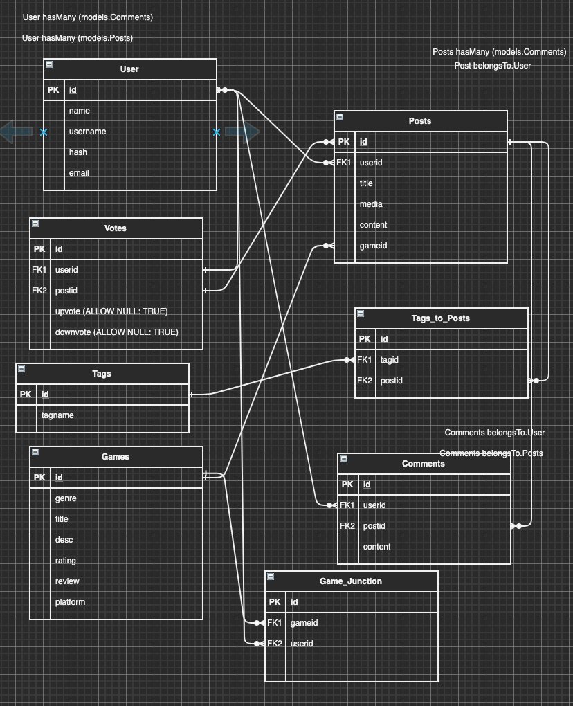
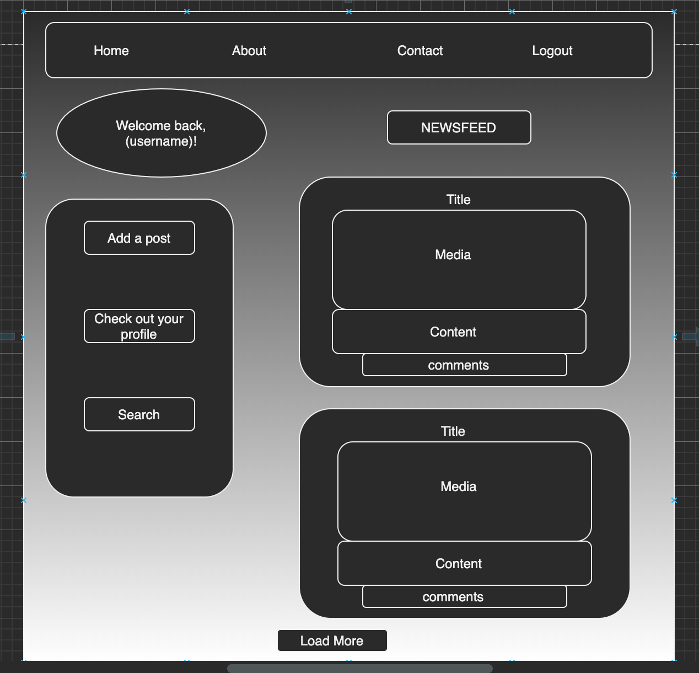
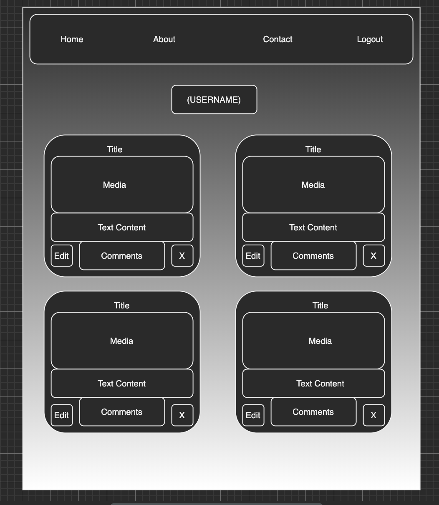

<tb></tb>

<h1 align="center"> Gamer's Paradise </h1>
 

<h2 align="center"> Objective/Goals </h2>
- This modern web application is a social media site for gamers, by gamers designed to bring gamers together. The app will allow users to post content, review other users content, and search based off of that content. 

 
<h2 align="center"> User Story </h2>

- As a User I want to see a Homepage with app info
- As a User I want to be able to sign up or login at the homepage
- As a User I want to login and see my posts and others post
- As a User I want to be able to add posts with pictures/videos using username 
- As a User I want to add comments to other's posts
- As a User I want to be able to Logout
- As a User I want to search for games 
- As a User I want to search for posts
- As a User I want to edit and delete my posts
- As a User I want to edit and delete my comments

 
<h2 align="center"> Tech/Tools Used </h2>

- HTML
- CSS - Flexbox, Grid
- Npm
- ExpressJS
- AWS
- JavaScript
- NodeJS
- Postgres/SQL
- SequelizeJS

 
<h2 align="center"> Problems Faced </h2> 

- Monday 1/11/21:
    - Adding and Linking foreignkey columns from User Table to Posts Table
    - Pulling User's specific username for every Post

- Tuesday 1/12/21:
  - Finding out how to log in with either username or email 
  - Verifying email or username to be unique regardless of capitalization
  - Calling displayname instead of username to show up on the pages.

- Wednesday 1/13/21:
  - Trying to attach the game model and the post model
  - Would not send the game information with each post because the relationship was not there
  - Added a gameid in the post model as a foreign key and used it to find the game title for each post and used the gameid as the url to link each game title to that game's display page

- Thursday 1/14/21:
  - Having some problems with CSS and Grid
  - Content not displaying correctly
  - Fixed it with trial and error

- Friday 1/15/21:
  - Had some CSS styling issues where things would not line up and overlay eachother
  - AWS server loadup

 
<h2 align="center"> Database Design </h2>

 
<h2 align="center"> Diagrams  </h2>

 
<h2 align="center"> Demo of App </h2>
-

 
<h2 align="center"> Contributors </h2>

### Joshua Lopez

- [Github](https://github.com/JoshuaNow)
- [Linkedin](https://www.linkedin.com/in/joshua-lopez-dev/)

### Ian Storms

- [Github](https://github.com/Stormy110)
- [Linkedin](https://www.linkedin.com/in/ianstorms/)

### Kevin Tucker

- [Github](https://github.com/k5tuck)
- [Linkedin](https://www.linkedin.com/in/ktuck18/)

### Shoel Uddin

- [Github](https://github.com/shoel-uddin)
- [Linkedin](https://www.linkedin.com/in/shoel-uddin/)